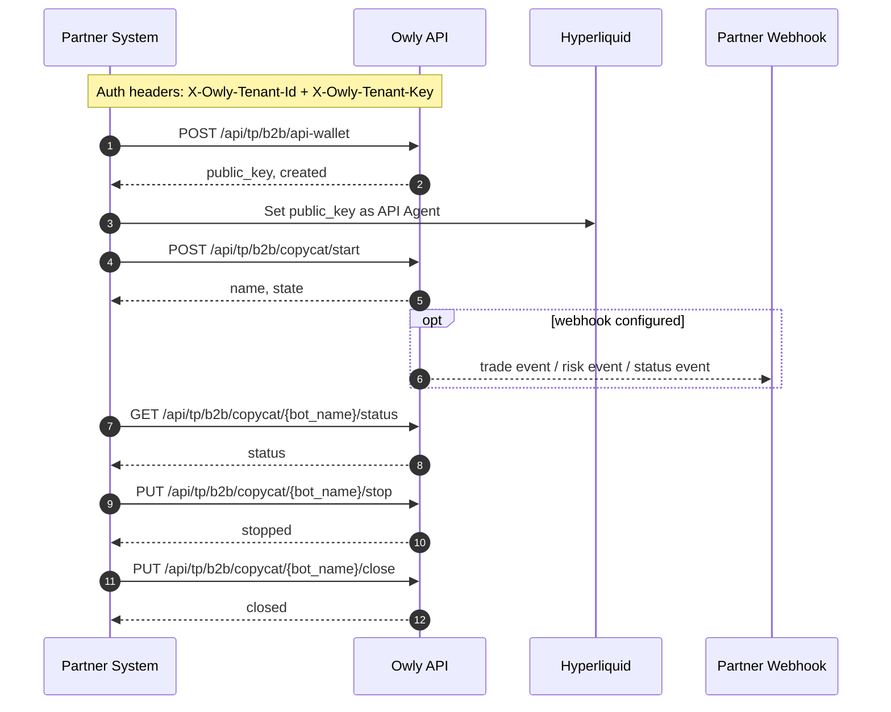

This guide is for business partners integrating Owly at the tenant level. It explains how to create an API wallet for a target address, start a strategy instance, receive webhook events, and manage the strategy lifecycle through Owly's external API.

<Note>
All B2B endpoints are authenticated with tenant credentials. If you are looking for standard end-user product setup, start from [Core Concepts](/guide/concepts) and [Quick Start](/guide/quick-start).
</Note>

## Integration Flow

The recommended order is:

1. Create or fetch an API wallet for the target address.
2. Set the returned `public_key` as the Hyperliquid API Agent.
3. Start the Owly strategy instance.
4. Save the returned bot identifier for later status and lifecycle calls.
5. Receive webhook notifications if configured.



## Base URL

| Environment | URL |
| --- | --- |
| Production | `https://app.owly.fi` |
| Development | `https://dev-app.owly.fi` |

## Authentication

Every request must include these headers:

```http
X-Owly-Tenant-Id: <tenant_id>
X-Owly-Tenant-Key: <tenant_key>
Content-Type: application/json
```

| Header | Required | Description |
| --- | --- | --- |
| `X-Owly-Tenant-Id` | Yes | Tenant identifier issued by Owly |
| `X-Owly-Tenant-Key` | Yes | Tenant secret issued by Owly |
| `Content-Type` | Yes | Must be `application/json` |

## Response Format

Successful responses follow this envelope:

```json
{
  "code": 0,
  "msg": "success",
  "timestamp": 1763471388,
  "data": {}
}
```

Error responses use:

```json
{
  "detail": "Error message description"
}
```

Common HTTP status codes:

| Status | Meaning |
| --- | --- |
| `400` | Invalid request parameters |
| `401` | Tenant authentication failed |
| `403` | Tenant or target account is unavailable |
| `404` | Resource not found |
| `409` | Resource state conflict |
| `500` | Internal service error |

## Step 1: Create or Fetch an API Wallet

### Endpoint

```http
POST /api/tp/b2b/api-wallet
```

### Request Body

```json
{
  "target": "0x1111111111111111111111111111111111111111"
}
```

| Field | Type | Required | Description |
| --- | --- | --- | --- |
| `target` | string | Yes | Target address that will run the strategy |

### Success Example

```json
{
  "code": 0,
  "msg": "success",
  "timestamp": 1763471388,
  "data": {
    "tenant_id": "tenant-demo",
    "target": "0x1111111111111111111111111111111111111111",
    "public_key": "0xaaaaaaaaaaaaaaaaaaaaaaaaaaaaaaaaaaaaaaaa",
    "created": true
  }
}
```

| Field | Type | Description |
| --- | --- | --- |
| `tenant_id` | string | Current tenant ID |
| `target` | string | Requested target address |
| `public_key` | string | API wallet public key that must be set as the Hyperliquid API Agent |
| `created` | boolean | `true` if the wallet was created now; `false` if an existing wallet was returned |

<Tip>
Owly securely stores the API wallet private key and does not return it to the partner.
</Tip>

Important behavior:

- Repeating the same request for the same `target` under the same tenant returns the existing wallet whenever possible.
- If the `target` is already occupied by another tenant or another incompatible flow, the API returns `409`.

## Step 2: Set the API Agent on Hyperliquid

Use the `public_key` returned in Step 1 and set it as the API Agent for the target address on Hyperliquid.

This step is completed by the partner on Hyperliquid. Owly does not perform the on-chain or Hyperliquid-side configuration for you.

## Step 3: Start the Strategy Instance

### Endpoint

```http
POST /api/tp/b2b/copycat/start
```

### Request Body

```json
{
  "config": {
    "bot_type": "copytrading",
    "target": "0x1111111111111111111111111111111111111111",
    "source": "0x2222222222222222222222222222222222222222",
    "copy_ratio": 1.0,
    "included_coins": [],
    "excluded_coins": [],
    "included_dexs": [""]
  },
  "webhook": "https://partner.example.com/owly/callback"
}
```

| Field | Type | Required | Description |
| --- | --- | --- | --- |
| `config` | object | Yes | Strategy configuration. This currently follows Owly's external `BotConfig` structure |
| `webhook` | string \| null | No | Event callback URL. Can override, clear, or fall back to a default value |

### Webhook Semantics

| Request shape | Behavior |
| --- | --- |
| omit `webhook` | Use the tenant default webhook; if no tenant default exists, keep the bot's current webhook |
| `webhook = "https://..."` | Override with a new webhook |
| `webhook = null` | Explicitly clear the webhook |

### Success Example

```json
{
  "code": 0,
  "msg": "success",
  "timestamp": 1763471390,
  "data": {
    "name": "bot_abc123",
    "state": "running"
  }
}
```

<Note>
The `name` field in the response is the `bot_name` used by the status, stop, and close endpoints. Persist it on your side.
</Note>

## Webhook Notifications

If a webhook is configured, Owly can actively deliver strategy events to your callback endpoint.

Webhook categories include:

- `trade event`: trading-related events produced by the strategy instance
- `risk event`: risk-control events produced by the strategy instance
- `status event`: strategy state changes

Webhook handling expectations:

- return `2xx` to acknowledge successful receipt
- design the receiver to be idempotent
- assume retries and duplicate deliveries are possible
- rely only on Owly's external event fields and business semantics, not internal service names or internal state machines

## Strategy Lifecycle Endpoints

### Get Status

```http
GET /api/tp/b2b/copycat/{bot_name}/status
```

Success example:

```json
{
  "code": 0,
  "msg": "success",
  "timestamp": 1763471391,
  "data": {
    "name": "bot_abc123",
    "state": "running"
  }
}
```

### Stop a Strategy

```http
PUT /api/tp/b2b/copycat/{bot_name}/stop
```

Success example:

```json
{
  "code": 0,
  "msg": "success",
  "timestamp": 1763471392,
  "data": {
    "name": "bot_abc123",
    "state": "stopped"
  }
}
```

### Close a Strategy

```http
PUT /api/tp/b2b/copycat/{bot_name}/close
```

`close` ends the lifecycle of the strategy instance. After closing, it no longer continues to run.

Success example:

```json
{
  "code": 0,
  "msg": "success",
  "timestamp": 1763471393,
  "data": null
}
```

## Common Errors

| Status | `detail` | Meaning |
| --- | --- | --- |
| `401` | `Invalid tenant key` | Tenant ID or key is incorrect |
| `403` | `Tenant is inactive` | The tenant is disabled |
| `403` | `Sub account is not active` | The target account is not currently available |
| `404` | `Bot not found` | The requested strategy instance does not exist |
| `409` | `Target is already managed by another tenant` | The target address is already occupied by another tenant |
| `409` | `Target is already registered outside tenant flow` | The target address is already occupied by a non-B2B flow |
| `409` | `Target is initialized with incompatible account state` | The target address already has an incompatible state |
| `500` | `Startup failed` | Strategy startup failed |

## Minimal cURL Example

### Create an API Wallet

```bash
curl -X POST "https://dev-app.owly.fi/api/tp/b2b/api-wallet" \
  -H "Content-Type: application/json" \
  -H "X-Owly-Tenant-Id: tenant-demo" \
  -H "X-Owly-Tenant-Key: tenant-secret" \
  -d '{
    "target": "0x1111111111111111111111111111111111111111"
  }'
```

### Start a Strategy

```bash
curl -X POST "https://dev-app.owly.fi/api/tp/b2b/copycat/start" \
  -H "Content-Type: application/json" \
  -H "X-Owly-Tenant-Id: tenant-demo" \
  -H "X-Owly-Tenant-Key: tenant-secret" \
  -d '{
    "config": {
      "bot_type": "copytrading",
      "target": "0x1111111111111111111111111111111111111111",
      "source": "0x2222222222222222222222222222222222222222",
      "copy_ratio": 1.0,
      "included_coins": [],
      "excluded_coins": [],
      "included_dexs": [""]
    },
    "webhook": "https://partner.example.com/owly/callback"
  }'
```

### Query Status

```bash
curl -X GET "https://dev-app.owly.fi/api/tp/b2b/copycat/bot_abc123/status" \
  -H "X-Owly-Tenant-Id: tenant-demo" \
  -H "X-Owly-Tenant-Key: tenant-secret"
```

## Integration Recommendations

- Always follow the sequence `api-wallet -> set API Agent on Hyperliquid -> start`.
- Persist the returned `bot_name` immediately.
- Make webhook consumers idempotent and retry-safe.
- Treat webhook events as Owly business notifications and do not depend on Owly internal implementation details.
- If `created = false`, reuse the returned `public_key`.
- If startup fails, first verify tenant authentication, Hyperliquid API Agent setup, target ownership, and whether `config` satisfies the current `BotConfig` requirements.
