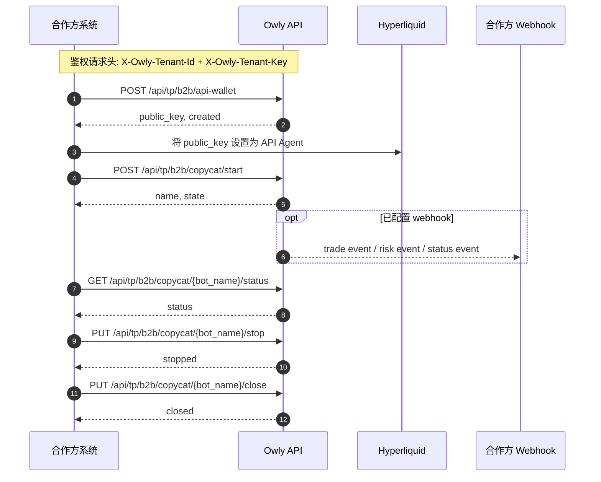

这篇文档面向与 Owly 进行租户级对接的合作方，说明如何为目标地址创建 API Wallet、启动策略实例、接收 webhook 事件，以及通过外部 API 管理策略生命周期。

<Note>
所有 B2B 接口都使用租户级凭证鉴权。如果你要了解普通用户如何开始使用 Owly，请先阅读 [核心概念](/zh/guide/concepts) 和 [快速入门](/zh/guide/quick-start)。
</Note>

## 接入流程

推荐按下面的顺序完成接入：

1. 为目标地址创建或获取 API Wallet。
2. 将返回的 `public_key` 设置为 Hyperliquid API Agent。
3. 启动 Owly 策略实例。
4. 保存返回的 Bot 标识，后续用于状态查询和生命周期管理。
5. 如果配置了 webhook，接收 Owly 主动推送的事件通知。



## Base URL

| 环境 | URL |
| --- | --- |
| 生产环境 | `https://app.owly.fi` |
| 开发环境 | `https://dev-app.owly.fi` |

## 鉴权方式

每个请求都需要携带以下请求头：

```http
X-Owly-Tenant-Id: <tenant_id>
X-Owly-Tenant-Key: <tenant_key>
Content-Type: application/json
```

| Header | 必填 | 说明 |
| --- | --- | --- |
| `X-Owly-Tenant-Id` | 是 | Owly 分配的租户标识 |
| `X-Owly-Tenant-Key` | 是 | Owly 分配的租户密钥 |
| `Content-Type` | 是 | 固定为 `application/json` |

## 通用响应格式

成功响应统一采用以下结构：

```json
{
  "code": 0,
  "msg": "success",
  "timestamp": 1763471388,
  "data": {}
}
```

错误响应格式为：

```json
{
  "detail": "Error message description"
}
```

常见 HTTP 状态码：

| 状态码 | 含义 |
| --- | --- |
| `400` | 请求参数错误 |
| `401` | 租户鉴权失败 |
| `403` | 租户或目标账户当前不可用 |
| `404` | 资源不存在 |
| `409` | 资源状态冲突 |
| `500` | 服务内部错误 |

## Step 1：创建或获取 API Wallet

### 端点

```http
POST /api/tp/b2b/api-wallet
```

### 请求体

```json
{
  "target": "0x1111111111111111111111111111111111111111"
}
```

| 字段 | 类型 | 必填 | 说明 |
| --- | --- | --- | --- |
| `target` | string | 是 | 将要运行策略的目标地址 |

### 成功响应示例

```json
{
  "code": 0,
  "msg": "success",
  "timestamp": 1763471388,
  "data": {
    "tenant_id": "tenant-demo",
    "target": "0x1111111111111111111111111111111111111111",
    "public_key": "0xaaaaaaaaaaaaaaaaaaaaaaaaaaaaaaaaaaaaaaaa",
    "created": true
  }
}
```

| 字段 | 类型 | 说明 |
| --- | --- | --- |
| `tenant_id` | string | 当前租户 ID |
| `target` | string | 请求中的目标地址 |
| `public_key` | string | API Wallet 公钥，需要设置为 Hyperliquid API Agent |
| `created` | boolean | `true` 表示本次新创建；`false` 表示返回了已有钱包 |

<Tip>
API Wallet 的私钥由 Owly 安全保管，不会返回给合作方。
</Tip>

这里还有几个关键行为需要注意：

- 同一租户重复请求同一个 `target` 时，Owly 会尽量返回已有的钱包。
- 如果 `target` 已被其他租户或其他不兼容流程占用，接口会返回 `409`。

## Step 2：在 Hyperliquid 设置 API Agent

使用 Step 1 返回的 `public_key`，在 Hyperliquid 中将其设置为目标地址对应的 API Agent。

这一步需要由合作方在 Hyperliquid 侧自行完成，Owly 不会替你执行链上或 Hyperliquid 侧配置。

## Step 3：启动策略实例

### 端点

```http
POST /api/tp/b2b/copycat/start
```

### 请求体

```json
{
  "config": {
    "bot_type": "copytrading",
    "target": "0x1111111111111111111111111111111111111111",
    "source": "0x2222222222222222222222222222222222222222",
    "copy_ratio": 1.0,
    "included_coins": [],
    "excluded_coins": [],
    "included_dexs": [""]
  },
  "webhook": "https://partner.example.com/owly/callback"
}
```

| 字段 | 类型 | 必填 | 说明 |
| --- | --- | --- | --- |
| `config` | object | 是 | 策略配置，当前沿用 Owly 对外暴露的 `BotConfig` 结构 |
| `webhook` | string \| null | 否 | 事件回调地址，支持覆盖、清空或走默认值 |

### `webhook` 语义

| 传参方式 | 行为 |
| --- | --- |
| 省略 `webhook` | 使用租户默认 webhook；如果租户也没有默认值，则保留 bot 当前已有的 webhook |
| `webhook = "https://..."` | 覆盖为新的 webhook |
| `webhook = null` | 显式清空 webhook |

### 成功响应示例

```json
{
  "code": 0,
  "msg": "success",
  "timestamp": 1763471390,
  "data": {
    "name": "bot_abc123",
    "state": "running"
  }
}
```

<Note>
响应里的 `name` 就是后续接口里使用的 `bot_name`。请在自己的系统里持久化保存。
</Note>

## Webhook 通知

如果配置了 webhook，Owly 会主动向合作方的回调地址推送策略事件。

常见通知类型包括：

- `trade event`：策略实例产生的交易相关事件
- `risk event`：策略实例产生的风控相关事件
- `status event`：策略状态变化事件

对 webhook 接收端的建议：

- 返回 `2xx` 表示接收成功
- 接收逻辑要按幂等方式设计
- 默认认为可能发生重试和重复投递
- 只依赖 Owly 对外约定的事件字段和业务语义，不要依赖内部服务名或内部状态机

## 策略实例管理接口

### 查询状态

```http
GET /api/tp/b2b/copycat/{bot_name}/status
```

成功响应示例：

```json
{
  "code": 0,
  "msg": "success",
  "timestamp": 1763471391,
  "data": {
    "name": "bot_abc123",
    "state": "running"
  }
}
```

### 停止策略实例

```http
PUT /api/tp/b2b/copycat/{bot_name}/stop
```

成功响应示例：

```json
{
  "code": 0,
  "msg": "success",
  "timestamp": 1763471392,
  "data": {
    "name": "bot_abc123",
    "state": "stopped"
  }
}
```

### 关闭策略实例

```http
PUT /api/tp/b2b/copycat/{bot_name}/close
```

`close` 表示结束该策略实例的生命周期。关闭后，该策略实例不会继续运行。

成功响应示例：

```json
{
  "code": 0,
  "msg": "success",
  "timestamp": 1763471393,
  "data": null
}
```

## 常见错误

| 状态码 | `detail` | 含义 |
| --- | --- | --- |
| `401` | `Invalid tenant key` | 租户 ID 或租户 Key 错误 |
| `403` | `Tenant is inactive` | 当前租户已被停用 |
| `403` | `Sub account is not active` | 目标账户当前不可用 |
| `404` | `Bot not found` | 对应策略实例不存在 |
| `409` | `Target is already managed by another tenant` | 目标地址已被其他租户占用 |
| `409` | `Target is already registered outside tenant flow` | 目标地址已被非 B2B 流程占用 |
| `409` | `Target is initialized with incompatible account state` | 目标地址已有不兼容状态 |
| `500` | `Startup failed` | 策略实例启动失败 |

## 最小 cURL 示例

### 获取 API Wallet

```bash
curl -X POST "https://dev-app.owly.fi/api/tp/b2b/api-wallet" \
  -H "Content-Type: application/json" \
  -H "X-Owly-Tenant-Id: tenant-demo" \
  -H "X-Owly-Tenant-Key: tenant-secret" \
  -d '{
    "target": "0x1111111111111111111111111111111111111111"
  }'
```

### 启动策略实例

```bash
curl -X POST "https://dev-app.owly.fi/api/tp/b2b/copycat/start" \
  -H "Content-Type: application/json" \
  -H "X-Owly-Tenant-Id: tenant-demo" \
  -H "X-Owly-Tenant-Key: tenant-secret" \
  -d '{
    "config": {
      "bot_type": "copytrading",
      "target": "0x1111111111111111111111111111111111111111",
      "source": "0x2222222222222222222222222222222222222222",
      "copy_ratio": 1.0,
      "included_coins": [],
      "excluded_coins": [],
      "included_dexs": [""]
    },
    "webhook": "https://partner.example.com/owly/callback"
  }'
```

### 查询状态

```bash
curl -X GET "https://dev-app.owly.fi/api/tp/b2b/copycat/bot_abc123/status" \
  -H "X-Owly-Tenant-Id: tenant-demo" \
  -H "X-Owly-Tenant-Key: tenant-secret"
```

## 接入建议

- 始终按 `api-wallet -> 在 Hyperliquid 设置 API Agent -> start` 的顺序执行。
- 拿到返回的 `bot_name` 后立刻做持久化保存。
- webhook 接收端建议实现幂等和重试保护。
- 把 webhook 事件视为 Owly 的业务通知，不要依赖 Owly 内部实现细节。
- 如果 `created = false`，直接复用返回的 `public_key`。
- 如果启动失败，优先检查租户鉴权、Hyperliquid API Agent 设置、目标地址归属，以及 `config` 是否满足当前 `BotConfig` 要求。
